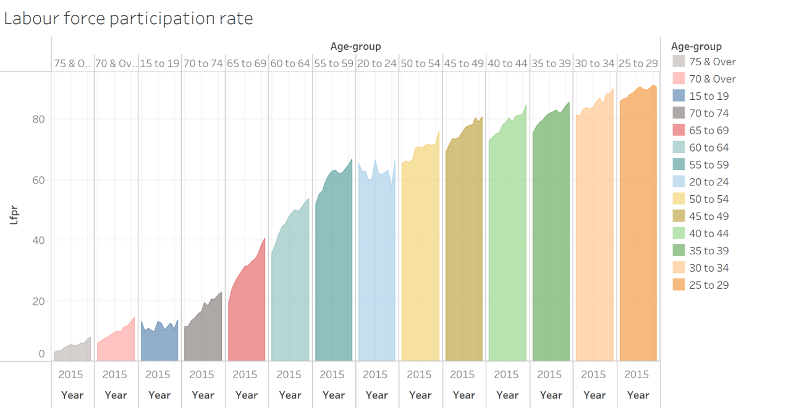

```{r setup, include=FALSE}
knitr::opts_chunk$set(echo = FALSE)
```

# 1.0 Critique of Visualisation

The original visualisation was created using data from the Department of Statistics (DOS). The data can be accessed via [Statistical Table: Labour Force Statistics](https://stats.mom.gov.sg/Pages/LabourForceTimeSeries.aspx).



## 1.1 Clarity

| S/N        | Critique           | Suggested Improvements  |
|:--- |:-------------|:--------------------|
| **1**          | **Y-axis title**: The y-axis uses an acronym "lfpr" which stands for labour force participation rate but is not immediately clear to readers. Also it does not show the unit of measurement which is in percentage (%).                     | Change the y-axis label to reflect the full spelling of the acronym "Labour Force Participation Rate (%)" together with the unit of measurement. | 
| **2**      | **X-axis**: The x-axis features the age-group and the year, but is repeated multiple times. Only the year "2015" is visible but the data is for a much larger period.    |   Change the formatting of the labelling to vertical, and signpost with the chart title to showcase that the data is for more than just 2015. |
| **3** | **Age-group order**: The visual aims to showcase the trend of the LFPR over different age groups but the age group in the current visual is randomly ordered. It should ideally follow an incremental order in age bands to clearly showcase any differences in LFPR between age bands.     |    Reorder the age groups to show it in an incremental order. |
| **4** | **Annotation and Sources**: Chart does not cite the source nor does it highlight any particular trends or figures to emphasize on the takeaway.      |    Add the data source as a note at the end, and highlight any noteworthy trends by including annotations or subtitles/captions. |
| **5**          | **Chart Title**: The current chart title "labour force participation rate" is fairly generic   and does not convey the intended analysis well. It should highlight the years for which the period of interest (i.e. 2010 to 2021) is, the targetted group (i.e. labour force in Singapore) and what we're looking at (LFPR).                 | A clearer title such as "Labour Force Participation Rate in Singapore (2010 - 2021)" alongside a sub-caption with a main takeout of the analysis would be helpful.|
| **6**          | **Single Source of Data**: The current visual uses the LFPR data which gives us an inkling of the changes in participation rates across the age groups. It does not paint the full picture of the labour force in Singapore - we could bring in other sources of data such as the absolute number of workers within in age group as a percentage of the labour force year-on-year. This would showcase the distribution of the labour force by age group in greater clarity, which will complement the participation rate data.                 | Bring in the data on the labour force distribution across the years from 2020 to 2021.|

## 1.2 Aesthetics

| S/N        | Critique           | Suggested Improvements  |
|:--- |:-----------------|:--------------|
|**1** |**Colour palette**: The colour palette choice is very jarring and uses too many contrasting colours which do not aim to bring the viewer's attention to anything in particular.|Since the colours are meant to denote the age-bands, we can use a single tone colour e.g. orange, but of different shades from light to dark to highlight that the darker the shade, the older the age-group.|
|**2** |**Chart Title**: Chart title is not immediately obvious and the font type and colour blends in with the axes. It could use a different typeface or size to make it clearer to the viewer that it is the title.|Use a bold typeface, or a different font (e.g. Tableau Bold) to highlight signpost the chart title.|
|**3** |**Chart/Age-Band Order**: The age is randomly sorted and the chart data looks like it has been sorted on ascending LFPR. In addition, the age-bands include "70 to 74", "75 & Over" and "70 & Over" which is an overlap of the previous 2 ranges. |Remove the age bands "70 to 74" and "75 & Over" to prevent viewers from being misled, as well as order the charts in accordance to ascending age-bands.|

# 2.0 Proposed Design

The image below shows an initial sketch of the proposed design.

# 3.0 Proposed Visualisation on Tableau

The final proposed visualisation created using *Tableau Desktop* can be accessed via *Tableau Public* [**here**](https://public.tableau.com/app/profile/mei.lin.kwong/viz/DatavizMakeover1_16447277207830/DataVizM1).


# 4.0 Step-by-step Preparation

## 4.1 Data Preparation

| No        | Instructions           | Action  |
|:--- |:-----------------|:------------------------------------------------------------------|
|**1** |Open csv file *mrsd_29_Res_LFPR_28Jan2022.xlsx* downloaded from DOS website in **Microsoft Excel**. Delete sheet named "mrsd_Res_LFPR_1". |{width=800px}|
|**2** |Remove unnecessary columns (Columns B to V). Select Columns > Right-click > Delete columns. |{width=800px}|
|**3** |Remove unnecessary rows (Rows 1-2, and Rows 17 onwards). Select Rows > Right-click > Delete rows. |{width=800px}|
|**4** |Rename header from "Age (Years)/Sex" to "Age Bands" and save this as *mrsd_29_Res_LFPR_28Jan2022_cleaned.xlsx*. |{width=800px}|
|**5** |Repeat steps 1 to 4 for the second dataset *mrsd_20_Res_labour_force_by_age_sex_28Jan2022.xlsx* and save the cleaned sheet as *mrsd_20_Res_labour_force_by_age_sex_28Jan2022_cleaned.xlsx* |{width=800px}|
|**6** |Drag the file *mrsd_20_Res_labour_force_by_age_sex_28Jan2022_cleaned.xlsx* to Tableau Desktop. 1) check "Cleaned with Data Interpreter" 2) Select all year columns from 2010 to Total 3) Right click > Pivot |{width=800px}|
|**7** |1) Right click the symbol as shown on the image and change data type to "Date" 2) Click Data > Export Data to CSV > Res Labour Force by Age & Sex|{width=800px}|
|**8** |Repeat steps 6 and 7 for the second xlsx *mrsd_29_Res_LFPR_28Jan2022_cleaned.xlsx*.|{width=800px}|
|**9** |Rename the csv containing the Labour Force Participation Rate as *LFPR_Percentage.csv* and the csv containing the absolute labour force figures as *LFP_Absolute_Figures.csv*.|{width=800px}|
|**10** |Open up both csv files side by side > Copy column C from *LFP_Absolute_Figures.csv* and paste into column D in *LFPR_Percentage.csv* > Save final csv as *LFP_Combined.csv*. |{width=800px}|
|**11** |Your final csv file should look something like this. |{width=400px}|

## 4.2 Data Visualisation


Distill is a publication format for scientific and technical writing, native to the web. 

Learn more about using Distill for R Markdown at <https://rstudio.github.io/distill>.


