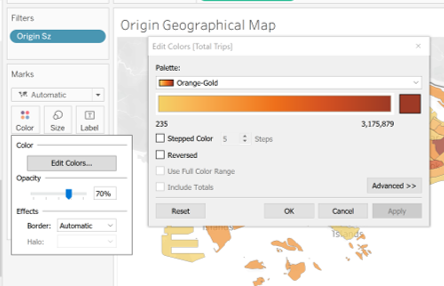
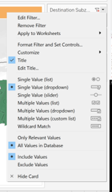

```{r setup, include=FALSE}
knitr::opts_chunk$set(echo = FALSE)
```


# 1.0 Critique of Visualisation

The original visualisation was created using data from the following sources:

* *origin_destination_bus_SZ_202201.csv*, this data set was downloaded from LTA Datamall and URA region, planning area and planning subzone information were added by using GIS Overlay operation.

* *MP14_SUBZONE_WEB_PL*, this data provides URA Master Plan 2014 Planning Subzone boundary map in ESRI shapefile format. It was downloaded from data.gov.sg.


## 1.1 Clarity

| S/N        | Critique           |
|:--- |:----------------------------------------------|
|1|**Use of Adjacency Matrix**: The use of the adjacency matrix to reveal information on intra and inter bus trip flows was not clear in this execution. The labels on both the destination and origin subzones were completely compressed and as such it is not immediately clear what kind of flow we are looking at. The use of black and white as the %total of trips also resulted in difficulty distinguishing which combination of origin-destination had the highest number of trips (based on colour) because of the number of bus stops on both the x and y-axis.|
|2 |**No chart titles/insights**: Lack of chart titles to clearly separate the type of information conveyed. It is not immediately clear what the adjacency matrix hopes to achieve, and the 4 barplots in the same colour without clear titling results in some initial confusion to distinguish that the 2 barcharts on the left are for origin subzones, and the two on the right are for destination subzones.|
|3 |**Misleading x-axis labels for bar-chart**: The bar-chart which aims to reveal the number of trips per hour on a weekday/weekend was missing the data for 0-4h which is available in the dataset.|

## 1.2 Aesthetics

| S/N        | Critique           |
|:--- |:----------------------------------------------|
|1|**Legend**: The legend for the origin and destination subzones contain too many radio-button options and requires the user to scroll down to look for the relevant subzone of choice for both fields. A single drop-down list could be more appropriate to make the dashboard look less cluttered.|
|2 |**Colour**: Single use of the colour blue for the barcharts for both origin and destination trips which look repetitive. One possible improvement could be to use two different colours to clearly differentiate barcharts relating to origin subzones, and destination subzones respectively to provide a visual aid for viewers.|
|3 |**Multiple Charts in One View**: The proportions of the charts could have been better scaled or separated in multiple views (through the Story function in Tableau). Adjacency matrix could be bigger vs. the barcharts - currently the view results in the adjacency matrix looking very compressed.|
|4 |**No labels on y-axis**: Bar-chart has no labels on the y-axis except "Weekday" and "Weekend" and users must currently infer that it refers to the total trips based on the title of the chart.|

## 1.3 Interactive Design

| S/N        | Critique           |
|:--- |:----------------------------------------------|
|1|**Poor use of filters**: The current filters for destination and origin subzones could be better represented as a dropdown list - single filter. Instead of 2 charts for weekday and weekends, a filter could be used to save on visual clutter.|
|2 |**Lack of dynamic filter on Adjacency Matrix**: Dynamic filters for Origin/Destination Subzones could be applied to the weekday adjacency matrix so that a more cohesive story between the number of trips by origin vs. the adjacency matrix can be told. |
|3 |**Lack of filtering on specific time periods**: The current filters do not allow for viewers to get a view on the travel patterns at specific time periods which may be of interest considering different commute patterns during peak and off-peak periods during weekdays. One improvement could be the addition of a dynamic time filter which can be applied to all views in this prototype.|

# 2.0 Proposed Design

The image below shows an initial sketch of the proposed design.


**Advantages of Proposed Design:**

### 2.1 Clarity

**Better use of colours**: The new design assigns brown/orange to information relating to Origin subzones, and green to information relating to Destination subzones. Moreover, the various shades also help to indiciate the number of trips (with a higer intensity suggesting a higher number of trips - in relation to the geographical map, relative to other subzones.

**More concise titles**: Comparing with the initial visualisation where views were not clearly demarcated with vague labels like "Weekday" and "Weekend", and filters all placed on the right, the proposed visualisation helps to more clearly position the filters in a more aesthetically pleasing manner, and where appropriate, at the right chart so users are not confused by which filter applies on which chart. Titles also dynamically change in response to filters used.

**Tooltips**: Previous tooltips did not have subzone information. Current proposed visualisation will have the subzone information together with number of trips.

### 2.2 Aesthetics

**Cleaner layout which is easier on the eyes**: The proposed visualisation makes use of the "Story" functionality in Tableau to create multiple compartmentalised views which results in less clutter compared to the old visualisation. We will place geographical maps in the main tab, followed by the analysis at the number of trips generated/attracted by the origin/destination subzones, as well as their corresponding top destination subzones and top origin subzones respectively.

**Use of colours**: Use of colours to indicate that orange is for the origin data and green is for destination data, making it less confusing for users on first viewing.

**Labelling**: Where necessary, clearer labels have been used e.g. for the bar charts instead of just "Weekday" without a label on the y-axis, the proposed visualisation uses labels such as "Total Trip from Origin Subzone", and "Total Trips to Destination Subzone" to remove any ambiguity.

### 2.3 Interactivity

**Single Dropdown filter for origin/destination subzone**: Use of drop-down filter results in less visual clutter.

**Slider filter for duration**: Use of slider filter for duration can be more intuitive for users to selecting a range, and is an added functionality from the original visualisation which did not allow viewers to drill down to a specific time frame for the data.


# 3.0 Proposed Visualisation on Tableau

The final proposed visualisation created using *Tableau Desktop* can be accessed via *Tableau Public* [**here**](https://public.tableau.com/app/profile/mei.lin.kwong/viz/DatavizMakeover2_16483315684060/BusTripOrigin-Destination-Jan2022).

**1st Tab - Geographical Overview of Bus Trips**

**2nd Tab - Total Trips + Origin-Destination (OD) Flow**


# 4.0 Step-by-step Preparation

## 4.1 Data Preparation

| No        | Instructions           | Action  |
|:--- |:-----------------|:------------------------------------------------------------------|
|**1** |Import the csv file *origin_destination_bus_SZ_202201.csv* into Tableau. Click Connection > Add > Spatial File and import *MP14_SUBZONE_WEB_PL.shp* |{width=200px}|
|**2** |Drag the file *MP14_SUBZONE_WEB_PL.shp* into the window to form a  connection with origin_destination_bus_SZ_202201.csv |{width=600px}|
|**3** |Form the relationship between the two files as indicated in the image (Origin Sz = Subzone N) |{width=600px}|
|**4** |Drag the file again into the window to form another connection with origin_destination_bus_SZ_202201.csv. You should see a connection similar to the image on the right |{width=600px}|
|**5** |Establish a new relationship between the two files (Destination Sz = SUBZONE N(MP14 SUBZONE WEB PL.shp1)|{width=600px}|

## 4.2 Data Visualisation

### 4.2.1 Creation of Origin Geographical Map

| No        | Instructions           | Action  |
|:--- |:-----------------|:------------------------------------------------------------------|
|**1** |Drag **Geometry** from the panel of variables and drag it to a new sheet (Rename it Origin Geographical Map) |{width=200px}|
|**2** |Rename "Origin Sz" to "Origin Subzone" and drag it as detail. Drag "Total Trips" to Colour |{width=400px}|
|**3** |Click **Colour** > **Edit Colors** > Change Palette to Orange-Gold, and opacity to 70% |{width=400px}|
|**4** |Convert "Time Per Hour" Measure into a Dimension. Right Click "Time Per Hour" > Convert to Dimension |{width=300px}|
|**5** |Drag the relevant variable under Filters "Time Per Hour", "Day Type", "Origin Subzone" |{width=300px}|
|**6** |Hover over the filter variables > click on the white triangle > show filters for "Day Type" and "Origin Subzone" |{width=300px}|
|**7** |Click on the black inverted triangle on "Origin Subzone" and "Day Type" > Select Single Value (dropdown)  |{width=300px}|
|**7** |Right Click Title > Edit Title > Change text to as per image. To get <Origin Subzone>, click insert > "Origin Subzone" |{width=300px}|
|**7** |Format the shading of the title > Right Click Title > Format Title > Choose shading as 79%, and respective colour |{width=300px}|

### 4.2.2 Creation of Origin Geographical Map

| No        | Instructions           | Action  |
|:--- |:-----------------|:------------------------------------------------------------------|
|**1** |Duplicate the "Origin Geographical Map" sheet and Rename it Destination Geographical Map |{width=200px}|
|**2** |Rename Destination Sz as Destination Subzone ||
|**3** |Replace the "Origin Subzone" under the details with "Destination Subzone" |{width=200px}|
|**4** |Replace the "Origin Subzone" under the filters with "Destination Subzone". When pop-out prompts click ok |{width=200px}|
|**5** |Change the colour > Click Colour > Edit Colours > Select "Green-Gold" |{width=200px}|
|**6** |Edit title as per image - changing the dynamic parameter to <Destination Subzone> |{width=200px}|
|**7** |Show Filter for "Destination Subzone" and click on the triangle > Select Single Value Dropdown |{width=200px}|
|**8** |Show Filter for "Time Per Hour" (You should see a slider range appear on the right)|{width=200px}|
|**8** |Right click title > Format Title > Change shading to 80% and shade of green |{width=200px}|


### 4.2.3 Creation of "Geographical Overview of Trips" Dashboard

| No        | Instructions           | Action  |
|:--- |:-----------------|:------------------------------------------------------------------|
|**1** |Create dashboard and rename it "Geographical Overview of Trips" ||
|**2** |Drag the sheets "Origin Geographical Map" and "Destination Geographical Map" into the window as shown in the image |{width=200px}|
|**3** |Right click the filters for "Origin Subzone" > Floating. Do the same for Total Trips and Destination Subzone |{width=200px}|
|**4** |Move the floating elements to the respective locations as shown in the image |{width=400px}|
|**5** |To get the legend for "Total Trips" for Destination > Hover over the destination sheet > click the triangle under the black bar > Legends > Click Color Legend |{width=400px}|
|**6** |When the legend appears > Click on the black scroll bar triangle > Floating |{width=200px}|
|**7** |Rearrange elements per the image on the right|{width=400px}|
|**7** |Drag the text object from the bottom left hand of the window, to the top (above the "Day Type" and "Time per Hour" filters > Edit text per the image|{width=400px}|

### 4.2.4 Creation of "Trips Generated" sheet

| No        | Instructions           | Action  |
|:--- |:-----------------|:------------------------------------------------------------------|
|**1** |Create new sheet named "Trips Generated"||
|**2** |Convert the "Time per Hour" variable to a dimension and discrete variable|{width=400px}|
|**3** |Drag variable "Total Trips" to rows, and "Time per Hour" to Columns, add the variables as shown in the image to filters and ensure that the "Time Per Hour" field under filers is a continuous variable|{width=400px}|
|**4** |Show filters for all of the filters as per previous steps. Click on the black triangle for "Origin Subzone" and "Day Type" and click Single Value (dropdown). For "Time Per Hour", it should appear as a range.|{width=400px}|
|**5** |Change the colour to orange (Colour > Click orange)|{width=400px}|
|**6** |Right click y-axis > Edit Axis > Change title to "Total Trips from Origin Subzone"|{width=400px}|
|**7** |Right click title > Edit Title|{width=400px}|
|**8** |Edit Text as per image on the right (to get the dynamic Origin Sz field -> Insert >select variable)|{width=400px}|
|**9** |Right click title > Format Title > Select Orange with 80% shading|{width=400px}|
|**10** |Right click on y-axis > Add Reference Line > Select parameters per the image > Right click the reference line > Format > Number (Custom) > Select 0dp|{width=400px}|


### 4.2.5 Creation of "Trips Attracted" sheet

| No        | Instructions           | Action  |
|:--- |:-----------------|:------------------------------------------------------------------|
|**1** |Duplicate "Trips Generated" sheet and rename as "Trips Attracted"|{width=400px}|
|**2** |Replace all variables with "Origin Subzone" to "Destination Subzone"||
|**3** |For Destination Sz filter > Show Filter |{width=100px}|
|**4** |Convert the "Destination Sz" filter to a single value (Dropdown) - for specific instructions please refer to previous sections e.g. 4.2.2 step 7 ||
|**5** |Change the colour of the chart (Colour > Change to green) ||
|**6** |Edit title text (Right click title > Edit Title > Change text per the image) ||
|**7** |Right Click Title > Format Title > Change the shading to green with 80%  |{width=400px}|
|**8** |Right Click y-axis > Edit axis > Change Axis Title text to Total Trips to Destination Subzone |{width=400px}|


### 4.2.6 Creation of "Top Destinations by Origin" sheet

| No        | Instructions           | Action  |
|:--- |:-----------------|:------------------------------------------------------------------|
|**1** |Duplicate "Trips Generated" sheet and rename as "Top Destinations by Origin" and remove all variables from Columns and Rows||
|**2** |Drag the Destination Subzone variable to filter > When the pop up appears > click ok|{width=400px}|
|**3** |Drag "Total Trips" to columns, and "Destination Subzone" to Rows, and "Total Trips" Under Detail|{width=400px}|
|**4** |Right click the x-axis > Remove Reference line |{width=400px}|
|**5** |Click on the multi bars beside "Total Trips" on the x-axis to sort according to descending trips |{width=400px}|
|**6** |Right click title > Edit Title > Change text as per image on the right |{width=400px}|

### 4.2.7 Creation of "Top Origins by Destination" sheet

| No        | Instructions           | Action  |
|:--- |:-----------------|:------------------------------------------------------------------|
|**1** |Duplicate "Trips Attracted" sheet and rename as "Top Origins by Destination" and remove all variables from Columns and Rows||
|**2** |Drag the Origin Subzone variable to filter > When the pop up appears > click ok|{width=400px}|
|**3** |Drag "Total Trips" to columns, and "Origin Subzone" to Rows, and "Total Trips" Under Detail|{width=400px}|
|**4** |Right click the x-axis > Remove Reference line |{width=400px}|
|**5** |Click on the multi bars beside "Total Trips" on the x-axis to sort according to descending trips |{width=400px}|
|**6** |Right click title > Edit Title > Change text as per image on the right |{width=400px}|

### 4.2.8 Creation of "Overview of Trips" **Dashboard**

| No        | Instructions           | Action  |
|:--- |:-----------------|:------------------------------------------------------------------|
|**1** |Create a new dashboard and name it "Overview of Trips"||
|**2** |Drag the relevant sheets as per the image into the main window pane|{width=400px}|
|**3** |Click and drag the filter tiles to the top most above space and arrange the tiles as per the image|{width=400px}|
|**4** |Drag the text object from the bottom left hand of the window, to the top (above the "Origin Subzone, "Destination Subzone", "Day Type" and "Time Per Hour" filters > Edit text per the image|image|{width=400px}|

### 4.2.9 Creation of "Bus Trip (Origin-Destination) - Jan 2022" Story

| No        | Instructions           | Action  |
|:--- |:-----------------|:------------------------------------------------------------------|
|**1** |Create a new story and name it "Bus Trip (Origin-Destination) - Jan 2022"||
|**2** |Drag the "Geographical Overview of Trips" dashboard into the main window |{width=400px}|
|**3** |Double click on the title and centralise the text per the image |{width=400px}|
|**4** |Click "Add a caption" and edit the first tab as "GEOGRAPHICAL OVERVIEW OF BUS TRIPS" |{width=400px}|
|**5** |Drag "Overview of Trips" dashboard to beside the grey button "GEOGRAPHICAL OVERVIEW OF BUS TRIPS" to create a new tab |{width=400px}|
|**6** |Click "Add a caption" and edit the second tab as "TOTAL TRIPS +
ORIGIN-DESTINATION FLOW" |{width=400px}|


# 5.0 Major Observations
