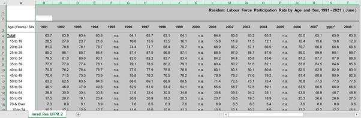

```{r setup, include=FALSE}
knitr::opts_chunk$set(echo = FALSE)
```

# 1.0 Critique of Visualisation

The original visualisation was created using data from the Department of Statistics (DOS). The data can be accessed via [Statistical Table: Labour Force Statistics](https://stats.mom.gov.sg/Pages/LabourForceTimeSeries.aspx).


## 1.1 Clarity

| S/N        | Critique           | Suggested Improvements  |
|:--- |:-------------|:--------------------|
| **1**          | **Y-axis title**: The y-axis uses an acronym "lfpr" which stands for labour force participation rate but is not immediately clear to readers. Also it does not show the unit of measurement which is in percentage (%).                     | Change the y-axis label to reflect the full spelling of the acronym "Labour Force Participation Rate (%)" together with the unit of measurement. | 
| **2**      | **X-axis**: The x-axis features the age-group and the year, but is repeated multiple times. Only the year "2015" is visible but the data is for a much larger period.    |   Change the formatting of the labelling to vertical, and signpost with the chart title to showcase that the data is for more than just 2015. |
| **3** | **Age-group order**: The visual aims to showcase the trend of the LFPR over different age groups but the age group in the current visual is randomly ordered. It should ideally follow an incremental order in age bands to clearly showcase any differences in LFPR between age bands.     |    Reorder the age groups to show it in an incremental order. |
| **4** | **Annotation and Sources**: Chart does not cite the source nor does it highlight any particular trends or figures to emphasize on the takeaway.      |    Add the data source as a note at the end, and highlight any noteworthy trends by including annotations or subtitles/captions. |
| **5**          | **Chart Title**: The current chart title "labour force participation rate" is fairly generic   and does not convey the intended analysis well. It should highlight the years for which the period of interest (i.e. 2010 to 2021) is, the targetted group (i.e. labour force in Singapore) and what we're looking at (LFPR).                 | A clearer title such as "Labour Force Participation Rate in Singapore (2010 - 2021)" alongside a sub-caption with a main takeout of the analysis would be helpful.|
| **6**          | **Single Source of Data**: The current visual uses the LFPR data which gives us an inkling of the changes in participation rates across the age groups. It does not paint the full picture of the labour force in Singapore - we could bring in other sources of data such as the absolute number of workers within in age group as a percentage of the labour force year-on-year. This would showcase the distribution of the labour force by age group in greater clarity, which will complement the participation rate data.                 | Bring in the data on the labour force distribution across the years from 2020 to 2021.|

## 1.2 Aesthetics

| S/N        | Critique           | Suggested Improvements  |
|:--- |:-----------------|:--------------|
|**1** |**Colour palette**: The colour palette choice is very jarring and uses too many contrasting colours which do not aim to bring the viewer's attention to anything in particular.|Since the colours are meant to denote the age-bands, we can use a single tone colour e.g. orange, but of different shades from light to dark to highlight that the darker the shade, the older the age-group.|
|**2** |**Chart Title**: Chart title is not immediately obvious and the font type and colour blends in with the axes. It could use a different typeface or size to make it clearer to the viewer that it is the title.|Use a bold typeface, or a different font (e.g. Tableau Bold) to highlight signpost the chart title.|
|**3** |**Chart/Age-Band Order**: The age is randomly sorted and the chart data looks like it has been sorted on ascending LFPR. In addition, the age-bands include "70 to 74", "75 & Over" and "70 & Over" which is an overlap of the previous 2 ranges. |Remove the age bands "70 to 74" and "75 & Over" to prevent viewers from being misled, as well as order the charts in accordance to ascending age-bands.|

# 2.0 Proposed Design

The image below shows an initial sketch of the proposed design.


**Advantages of Proposed Design:**

**a) Clear Titles (Main, Chart Titles, and Sub-Titles)**

* Main title reflects what the entire dashboard aims to present (i.e. an analysis/charts pertaining to Singapore's Labour Force Participation Rate and Distribution by Age Bands (2010 - 2021))

* Chart titles highlight and signpost key insights and takeaway from each chart, with accompanying subtitles to highlight the specific insight in greater detail. Figure labels to indicate the general data visualised.

**b) Removal of additional age bands "75 & Over" and "70 to 74"**

* This presents a less misleading visual as compared to the original which had 3 bands which overlapped (i.e. "75 & Over", "70 to 74" and "70 and over")

**c) Re-ordered Age bands in increasing order**

* Since the chart aims to present the changes in LFPR and distribution of workforce over time between age groups, it would be more ideal to present the order of the age bands in increasing order as suggested in the sketch, as opposed to the current visual which seems to have randomly ordered it.

**d) Concisely labelled y-axis**

* The original visualisation used the "lfpr" acronym which may not be intuitive to viewers. The suggested sketch clearly spells out the full acronym "Labour Force Participation Rate (LFPR%)" which is more explicit, as well as presents the unit of measurement (%) to eliminate any ambiguity.

**e) Unclear time frame from the x-axis which had year repeated**

* The original sketch seemed to suggest the data was from 2015. With clearer signposting through the chart titles, it would be clearer that the data is from 2010 to 2021.

**f) Alternative sources of data to complement existing LFPR data**

* The second chart on the labour force distribution aims to complement the existing chart on LFPR by painting a picture of an ageing workforce which ties in nicely with the increasing labour force participation rate amongst the older age-group vs. a decline in LFPR in the younger age group.

**g) Annotations to highlight key insights and takeaways**

* The proposed sketches aims to include more annotations to highlight key trends within each age group to grab the viewer's attention upon first glance.

**h) Citing of Source**

* The proposed sketch also indicates the source of the data for LFPR and the workforce distribution from the Department of Statistics to allow viewers to access the source data for themselves. 

**i) Inclusion of trendlines on top of the area chart**

* The inclusion of trendlines alongside the annotation (to showcase the overall change in % points) highlights the general trend within each age-band across the different age-groups.

**j) Better use of colours i.e. single tone**

* The use of colours in the original visualisation could have been made more purposeful rather than haphazardly selecting colours which do not complement one another. In the proposed sketch, a single colour could be used but of increasing opacity (i.e. light to dark) to intuitively suggest to viewers about the increasing order of the age bands.

# 3.0 Proposed Visualisation on Tableau

The final proposed visualisation created using *Tableau Desktop* can be accessed via *Tableau Public* [**here**](https://public.tableau.com/app/profile/mei.lin.kwong/viz/DatavizMakeover1_16447277207830/DataVizM1).


# 4.0 Step-by-step Preparation

## 4.1 Data Preparation

| No        | Instructions           | Action  |
|:--- |:-----------------|:------------------------------------------------------------------|
|**1** |Open csv file *mrsd_29_Res_LFPR_28Jan2022.xlsx* downloaded from DOS website in **Microsoft Excel**. Delete sheet named "mrsd_Res_LFPR_1". |{width=600px}|
|**2** |Remove unnecessary columns (Columns B to V). Select Columns > Right-click > Delete columns. |{width=600px}|
|**3** |Remove unnecessary rows (Rows 1-2, and Rows 17 onwards). Select Rows > Right-click > Delete rows. |{width=600px}|
|**4** |Rename header from "Age (Years)/Sex" to "Age Bands" and save this as *mrsd_29_Res_LFPR_28Jan2022_cleaned.xlsx*. |{width=600px}|
|**5** |Repeat steps 1 to 4 for the second dataset *mrsd_20_Res_labour_force_by_age_sex_28Jan2022.xlsx* and save the cleaned sheet as *mrsd_20_Res_labour_force_by_age_sex_28Jan2022_cleaned.xlsx* |{width=600px}|
|**6** |Drag the file *mrsd_20_Res_labour_force_by_age_sex_28Jan2022_cleaned.xlsx* to Tableau Desktop. 1) check "Cleaned with Data Interpreter" 2) Select all year columns from 2010 to Total 3) Right click > Pivot |{width=600px}|
|**7** |1) Right click the symbol as shown on the image and change data type to "Date" 2) Click Data > Export Data to CSV > Res Labour Force by Age & Sex|{width=600px}|
|**8** |Repeat steps 6 and 7 for the second xlsx *mrsd_29_Res_LFPR_28Jan2022_cleaned.xlsx*.|{width=800px}|
|**9** |Rename the csv containing the Labour Force Participation Rate as *LFPR_Percentage.csv* and the csv containing the absolute labour force figures as *LFP_Absolute_Figures.csv*.|{width=600px}|
|**10** |Open up both csv files side by side > Copy column C from *LFP_Absolute_Figures.csv* and paste into column D in *LFPR_Percentage.csv* > Save final csv as *LFP_Combined.csv*. |{width=600px}|
|**11** |Your final csv file should look something like this. |{width=400px}|

## 4.2 Data Visualisation

**LFPR(%) Sheet**

| No        | Instructions           | Action  |
|:--- |:-----------------|:------------------------------------------------------------------|
|**1** |Drag the csv *LFPR_Percentage.csv* into Tableau. |{width=400px}|
|**2** |Create sheet with 1st Visualisation - LFPR (%) |{width=400px}|
|**3** |Drag the variable names accordingly into the column and rows as shown in the image. Drag the Year and Age Bands variable into filter. Right click on the Age Bands under "Filter" and uncheck "Total". Next, drag "Age Bands" variable to "Colour".|{width=400px}|
|**4** |Click the "Colour" button > "Edit Colors" > In the pop out, select "Orange" under Color palette and assign the palette to the age-bands > Click Ok|{width=400px}|
|**5** |Right click on any part of the graph > Trend Lines > Show Trend Lines|{width=400px}|
|**6** |Right click on the trend line > Format > Change the colour of the line|{width=400px}|
|**7** |Right click on x-axis Lfpr > Edit Axis > Change the Axis title to "Labour Force Partitipcation Rate (LFPR%)|{width=400px}|
|**8** |Right Click on title > Edit Title > Edit Text Accordingly <Tableau Bold - size 13> More Singaporeans across all age groups work from 2010 - 2021 with the exception of those aged 20-24. <Tableau Light - size 9> "The increase in Labour..... at 20%" and italicised with underline for the Figure text|{width=400px}|
|**9** |Adding Annotations to mark insights: For boxes > Right Click on the point which you wish to mark > Annotate > Point > Step 2: Edit the Text > Step 3: Right Click the annotation > Step 4: Format annotation to include border and arrow > Repeat these steps for the other box annotations |{width=400px}|
|**10** |Adding Annotations for change in percentage: For the annotations for trend lines (i.e. change in LFPR over the years): Do the same as in step 9, except Annotate > Area > and under format select "None" for line and shading. For coloured text > edit colour when editing text |{width=400px}|

**Labour Share Sheet**

| No        | Instructions           | Action  |
|:--- |:-----------------|:------------------------------------------------------------------|
|**1** |Create sheet with 2nd Visualisation - Labour Share |{width=400px}|
|**2** |Create new Age band group: Right click [Age band] > Create > Group. Group the bands according to the image |{width=400px}|
|**3** |Drag [Age Band] to the filter as in the above section and uncheck Total |{width=400px}|
|**4** |Create stacked bar chart by dragging the variables according to the image on the right> Right click on sum(Labour force) and click quick table calculation > Percent of Total, then Right click again > Compute using > Age bands |{width=400px}|
|**5** |Drag [Age Bands] to Color and using the same steps as per the previous sheet > Assign the orange palette to the individual bands. Next, drag Labour force to "Label" > Click on Label > Select "Selected" under "Marks to Label" > Right click on the individual segments of the stacked bars for 2010 and 2021 and click "Mark Label" > "Always Show"|{width=400px}|
|**6** |Change the x-axis text by right clicking on the x-axis > Edit Axis > Change axis title to "Total share of labour force"|{width=400px}|
|**7** |Right click on the title > Edit Title > Edit title text as per image |{width=400px}|

**Creation of Dashboard**

| No        | Instructions           | Action  |
|:--- |:-----------------|:------------------------------------------------------------------|
|**1** |Drag "LFPR(%)" sheet to the dashboard, followed by the "Labour Share" Sheet below > Remove the legends for Range of Year and Age Bands|{width=400px}|
|**2** |Drag a text object to the top of the dashboard (Objects > Text), and edit the text as shown in the image > To achieve the black background: Go to Layout > Background > Select colour |{width=400px}|
|**3** |Source text: Drag a text object to the bottom > Edit text as per image > size 8 font, Tableau Book font for normal text, and Tableau Bold for bolded text |{width=800px}|

# 5.0 Major Observations

## 5.1 Labour Force Participation Rate in Singapore (2010 - 2021)

1. Generally, more Singaporeans across all age groups worked from 2010 to 2021 with the exception of those within the age group of 20 - 24.

2. Particularly, the **20 - 24 age group** saw a decline in Labour Force Participation Rate (LFPR) of -3.4%. According to MOM, this decline in overall labour force participation was because of an increase in youths pursuing higher education [(Ministry of Manpower, 2011)](https://stats.mom.gov.sg/iMAS_PdfLibrary/mrsd-youths-in-the-labour-market-09Nov11.pdf).

3. The **20 - 24 age group** experienced a sharp decline in LFPR of -5% in 2020 but bounced back in 2021. According to a report by MOM in 2021, this was due to youths aged 15 to 24 *experiencing the largest decrease in employment rate among all age groups, reflecting the employment contraction in sectors where they commonly worked such as Food & Beverage Services, Administrative & Support Services and Retail Trade*. [(Para 2.1: Ministry of Manpower, 2021)](https://stats.mom.gov.sg/iMAS_PdfLibrary/mrsd_2020LabourForce_survey_findings.pdf)

4. The steepest increase in LFPR was noted for the **65-69 age group** at **+20.0%**. This group saw an increase in LFPR despite the presence of COVID-19. According to a report by MOM in 2021, this was due to the *sustained efforts to raise the employability of older workers and higher demand for essential services like cleaning and security amid the COVID-19 outbreak*.[(Para 2.3: Ministry of Manpower, 2021)](https://stats.mom.gov.sg/iMAS_PdfLibrary/mrsd_2020LabourForce_survey_findings.pdf)

## 5.2 Labour Force Distribution in Singapore (2010 - 2021)

1. Generally, the labour workforce in Singapore is getting older. The proportion of **workers aged 55-64** has *increased* from 13.5% to 17.6% (+4.1%) from 2010 to 2021, compared to the *decline* from 73.7% to 66.8% (-6.9%) observed amongst the **25-54 age group**.

<center> **--End of Dataviz Makeover 1--** </center>


